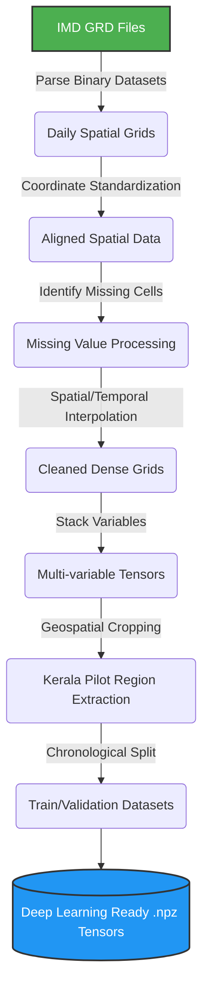
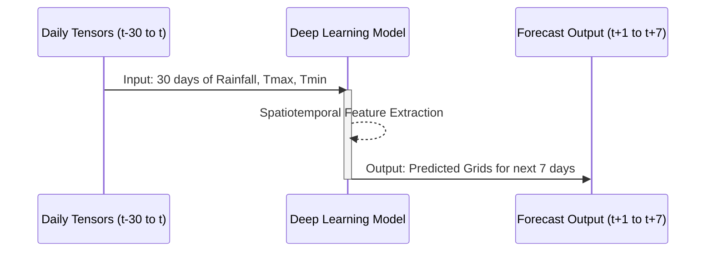

# 🌏 AI-Powered Climate Digital Twin: Data Preprocessing Pipeline

> A complete preprocessing framework for converting raw Indian Meteorological Department (IMD) gridded climate datasets into deep learning–ready spatiotemporal tensors for Climate Digital Twin applications.


---

## 📌 Overview & Objective

This repository contains the data preprocessing pipeline developed for the **AI-Powered Climate Digital Twin** project. 

The primary objective is to transform raw daily climate observations from the **Indian Meteorological Department (IMD)** into structured, spatiotemporal tensors. These cleaned, aligned, and scaled tensors serve as the foundation for training advanced deep learning architectures such as **ConvLSTM, CNN-LSTM, Vision Transformers**, and other spatiotemporal forecasting networks. 

The dataset targets the forecasting of critical meteorological variables:
- 🌧 **Rainfall**
- 🌡 **Maximum Temperature (Tmax)**
- 🌡 **Minimum Temperature (Tmin)**

---

## ⚙️ Pipeline Architecture

The pipeline processes raw binary grids into machine-learning-ready outputs through a sequential process of parsing, alignment, imputation, and regional extraction.



---

## 📊 Dataset Characteristics

The pipeline utilizes historical gridded observations provided by the **India Meteorological Department (IMD)**.

| Variable | Unit | Temporal Resolution | Spatial Resolution | Spatial Coverage |
|----------|------|---------------------|-------------------|------------------|
| **Rainfall** | mm/day | Daily | 0.25° x 0.25° | India Subcontinent |
| **Tmax** | °C | Daily | 0.25° x 0.25° | India Subcontinent |
| **Tmin** | °C | Daily | 0.25° x 0.25° | India Subcontinent |

---

## 📁 Repository Structure

```text
Digital-Twin/
├── notebooks/                # End-to-end interactive preprocessing notebooks
├── src/                      
│   └── climate_preprocessing/ # Core package modules
│       ├── parser.py         # IMD GRD binary parser (placeholder)
│       ├── interpolator.py   # Spatial/temporal interpolation logic (placeholder)
│       ├── tensor_gen.py     # Multi-variable tensor construction (placeholder)
│       └── utils.py          # Coordinate & geospatial utilities (placeholder)
├── processed/                # Output directory for generated tensors (.npz)
├── metadata/                 # Configuration and dataset metadata files
├── logs/                     # Execution logs for the pipeline
├── config.py                 # Pipeline configuration settings
├── requirements.txt          # Python dependencies
├── pyproject.toml            # Project packaging configuration
└── README.md                 # Project documentation
```

---

## 🛠️ Preprocessing Workflow Stages

### Stage 1: GRD Parsing & Alignment
Raw IMD binary files are parsed into NumPy arrays to extract daily raster grids, latitudes, longitudes, and dates. Different variables (Rainfall, Tmax, Tmin) are strictly aligned onto the identical geographical grid to ensure spatial consistency.

### Stage 2: Missing Value Imputation
The pipeline detects missing land observations (represented as `NaN`), preserves ocean pixels properly, and interpolates valid land observations to ensure a dense, continuous spatial matrix without data holes.

### Stage 3: Tensor Construction
Daily grids for each variable are stacked to create a 4-dimensional tensor structure ready for sequence modeling.
* **Shape:** `(Time, Variables, Latitude, Longitude)`

### Stage 4: Regional Trimming (Kerala Pilot Region)
To optimize model training, reduce computational overhead, and allow rapid prototyping, the nationwide tensor is geographically cropped to the **Kerala Pilot Region**.

| Region | Latitudes | Longitudes | Tensor Grid Size |
|--------|-----------|------------|------------------|
| **India (Original)** | 8.0°N to 38.0°N | 68.0°E to 98.0°E | `129 × 135` |
| **Kerala (Extracted)**| 8.0°N to 13.0°N | 74.5°E to 77.5°E | `21 × 13` |

### Stage 5: Train/Validation Split
The dataset is separated chronologically to prevent temporal data leakage:
- **Training Set:** 2012 – 2024
- **Validation Set:** 2025 onwards

---

## 📦 Output Artifacts

The final artifacts are stored as compressed NumPy `.npz` files:
- `train_tensor_kerala.npz`
- `validation_tensor_kerala.npz`

Each `.npz` archive contains the following arrays:
- `tensor`: The main climate tensor of shape `(Time, 3, 21, 13)`
- `dates`: Chronological daily timestamps
- `latitudes` / `longitudes`: Coordinate axes arrays
- `rainfall_mask`: A boolean land mask used to filter out invalid/ocean spatial locations during model loss calculation.

---

## 🚀 Model Application & Flow

The final tensors are designed to be ingested by advanced temporal forecasting architectures. A typical sequence-to-sequence forecasting flow looks like this:



**Key Advantages:**
* ✔️ Fully automated, reproducible pipeline
* ✔️ Zero-leakage chronological splitting
* ✔️ Ready-to-use for models like ConvLSTM, ViT, and Spatiotemporal Transformers
* ✔️ Memory-efficient regional extractions

---

## 🔮 Future Extensions

Future iterations of the pipeline will incorporate additional atmospheric variables:
- Relative Humidity & Surface Pressure
- Wind Speed and Direction
- Soil Moisture & Solar Radiation
- Satellite-derived observation products

---

## 💡 Applications

- 🌍 **Climate Digital Twins:** Simulating local climate variations.
- 🌦️ **Weather Forecasting:** High-resolution regional weather prediction.
- 🚨 **Disaster Management:** Early warning systems for floods and heatwaves.
- 🌾 **Agriculture:** Precision agriculture and crop yield forecasting.

---

### Author
**Aditya Raj**  
*AI-Powered Climate Digital Twin Project*